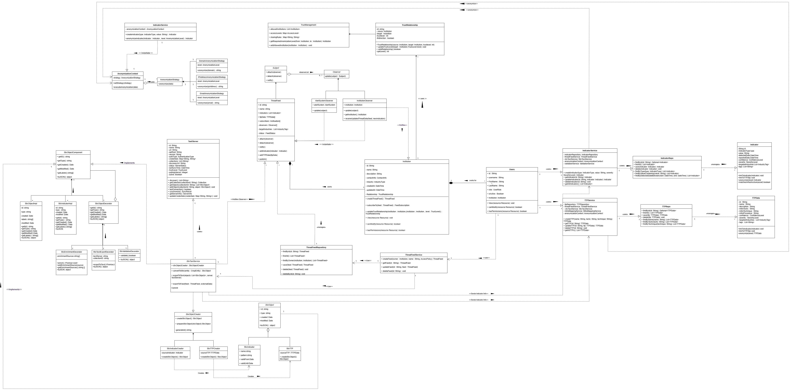

# Software Requirements Specification (SRS)
## CRISP - Cyber Risk Information Sharing Platform

**Version:** 1.1  
**Date:** May 26, 2025  
**Prepared by:** Data Defenders  
**Client:** BlueVision ITM

---

## Table of Contents

1. [Introduction](#1-introduction)
2. [User Stories / User Characteristics](#2-user-stories--user-characteristics)
3. [Domain Model](#3-domain-model)
4. [Use Cases](#4-use-cases)
5. [Functional Requirements](#5-functional-requirements)
6. [Service Contracts](#6-service-contracts)
7. [Architectural Requirements](#7-architectural-requirements)
8. [Technology Requirements](#8-technology-requirements)
9. [Appendices](#9-appendices)

---

## 1. Introduction

### 1.1 Business Need
Educational institutions face increasing cyber threats with limited resources for threat intelligence sharing. Recent months have shown a disturbing trend where once an educational Institution is attacked, similar institutions often become subsequent targets. CRISP addresses the critical need for timely and effective information sharing regarding cyber security incidents among educational institutions, enabling proactive defense against emerging threats.

### 1.2 Project Scope
CRISP will provide a web-based platform for BlueVision ITM to serve their clients with:
- Secure threat intelligence sharing using industry standards (STIX/TAXII)
- Anonymization of sensitive Institutional data while preserving analytical value
- Integration with external threat intelligence sources
- Real-time threat alerting and notification systems
- Trust-based access control and data sharing between Institutions
- Autonomous sharing between distributed CRISP instances

The platform will facilitate both consumption of external threat feeds and publication of anonymized threat data, ensuring confidentiality while maximizing the benefit of shared intelligence.

### 1.3 Definitions and Abbreviations
- **CRISP**: Cyber Risk Information Sharing Platform
- **STIX**: Structured Threat Information eXpression
- **TAXII**: Trusted Automated eXchange of Intelligence Information
- **IoC**: Indicators of Compromise
- **TTP**: Tactics, Techniques, and Procedures
- **CTI**: Cyber Threat Intelligence

### 1.4 Team Members
- **Armand van der Colf** - u22574982 (Full Stack Developer & Security)
- **Jadyn Stoltz** - u22609653 (Team Lead & AI/ML Systems Engineer)
- **Diaan Botes** - u22598538 (Full Stack Developer & Data Scientist)
- **Liam van Kasterop** - u22539761 (Backend Developer)
- **Dreas Vermaak** - u22497618 (Backend Developer)

---

## 2. User Stories / User Characteristics

### 2.1 User Hierarchy and Roles

#### BlueVision ITM System Administrator
- **Role**: Platform administrator with full system access
- **Purpose**: Manage the entire CRISP platform, onboard new client Institutions, and maintain system health

#### Institution Publisher (Client Institutions)
- **Role**: BlueVision ITM clients who have publishing rights
- **Purpose**: Represent educational institutions that can both publish and consume threat intelligence

#### Institution Users (Viewers)
- **Role**: Users within client Institutions with viewing rights only
- **Purpose**: Security analysts and IT staff who need access to threat intelligence but cannot publish

### 2.2 User Stories

#### BlueVision ITM System Administrator Stories
- As a System Administrator, I want to register new client Institutions so that they can join the threat sharing community
- As a System Administrator, I want to manage Institution accounts and their settings so that I can control platform access and configurations
- As a System Administrator, I want to monitor system health and usage statistics so that I can ensure platform reliability and optimize performance
- As a System Administrator, I want to configure global anonymization policies so that sensitive data is properly protected across all Institutions
- As a System Administrator, I want to manage trust relationships between Institutions so that I can control data sharing permissions
- As a System Administrator, I want to access comprehensive audit logs so that I can track system usage and investigate security incidents

#### Institution Publisher (Client) Stories
- As an Institution Publisher, I want to publish threat intelligence about attacks on my institution so that I can help protect other educational Institutions
- As an Institution Publisher, I want to add users from my Institution via email invitation so that my team can access relevant threat intelligence
- As an Institution Publisher, I want to configure what types of threats my Institution shares so that I can control our data sharing policies
- As an Institution Publisher, I want to set anonymization levels for different types of data so that I can protect sensitive institutional information
- As an Institution Publisher, I want to consume threat feeds from other Institutions so that I can stay informed about relevant threats
- As an Institution Publisher, I want to receive alerts about threats targeting educational institutions so that I can proactively defend my Institution
- As an Institution Publisher, I want to manage my Institution's users and their permissions so that I can control who has access to what information
- As an Institution Publisher, I want to upload threat intelligence in bulk via CSV/JSON so that I can efficiently share large datasets

#### Institution User (Viewer) Stories
- As an Institution User, I want to view threat intelligence relevant to my institution so that I can understand current threat landscape
- As an Institution User, I want to receive real-time alerts about high-priority threats so that I can respond quickly to emerging risks
- As an Institution User, I want to search and filter threat intelligence by type, date, and severity so that I can find relevant information quickly
- As an Institution User, I want to export threat data for integration with our security tools so that I can enhance our defensive capabilities
- As an Institution User, I want to view threat trends and analytics so that I can understand attack patterns targeting educational institutions
- As an Institution User, I want to access threat intelligence via API so that I can integrate with existing security systems

#### External API User Stories
- As an External System, I want to consume threat intelligence via TAXII-compliant endpoints so that I can integrate with existing security tools
- As an External System, I want to authenticate securely via JWT tokens so that I can access authorized threat data programmatically
- As an External System, I want to receive standardized STIX-formatted data so that I can easily process threat intelligence

---

## 3. Domain Model

### 3.1 UML Class Diagram


### 3.2 Core Domain Entities Description
- **User**: System users with different roles (Admin, Publisher, Viewer) and authentication details
- **Institution**: Client institutions with publishing capabilities and user management
- **ThreatIntelligence**: Core threat data including IoCs, TTPs, with anonymization metadata
- **Feed**: External and internal threat intelligence sources and subscriptions
- **Alert**: Notifications for high-priority threats with customizable criteria
- **TrustRelationship**: Defines sharing permissions and anonymization levels between Institutions
- **AnonymizationPolicy**: Rules for protecting sensitive data while preserving analytical value

---

## 4. Use Cases

### 4.1 Use Case Diagrams
The following five essential use case diagrams illustrate the core functionality and interactions within the CRISP system:

1. **System Overview** - High-level view of all major actors and primary use cases



2. **Threat Intelligence Publication and Sharing** - Core value creation through threat data sharing


3. **Threat Intelligence Consumption and Alerts** - Core value consumption and notification system


4. **User and Institution Management** - Foundation user and Institution administration


5. **Data Validation and Quality Assurance** - Ensuring data integrity and STIX compliance


6. **Anonymization and Trust Management Use Case Diagram** - how CRISP handles sensitive data protection


### 4.2 Use Case Relationships

#### 4.2.1 Actor Relationships
- **System Administrator** has administrative access to all system functions
- **Institution Publisher** inherits Institution User capabilities plus publishing rights
- **Institution User** has read-only access to authorized threat intelligence

### 4.3 Use Case Priorities

#### 4.3.1 Critical Use Cases (Must Have)
1. **User Authentication and Authorization** - Foundation for all system access
2. **Threat Intelligence Publication** - Core value creation functionality
3. **Threat Intelligence Consumption** - Core value consumption functionality
4. **Institution Management** - Essential for multi-tenant architecture
5. **Data Validation and STIX Compliance** - Required for standards compliance

#### 4.3.2 Important Use Cases (Should Have)
1. **Real-time Alert System** - Enhances threat response capabilities
2. **Trust Relationship Management** - Enables controlled data sharing
3. **Bulk Data Upload** - Improves operational efficiency
4. **External Feed Integration** - Enriches threat intelligence sources
5. **Data Anonymization** - Protects sensitive Institutional information

#### 4.3.3 Enhancement Use Cases (Could Have)
1. **Advanced Analytics and Reporting** - Provides deeper threat insights
2. **API Rate Limiting and Throttling** - Protects system resources
3. **Audit Trail Management** - Enhances security and compliance
4. **System Health Monitoring** - Improves operational visibility
5. **Data Export Capabilities** - Supports integration requirements

### 4.4 Cross-Functional Use Cases

#### 4.4.1 Security Use Cases
- **Secure Authentication** - Multi-factor authentication for administrative accounts
- **Data Encryption** - End-to-end encryption for sensitive threat intelligence
- **Access Control** - Role-based permissions with principle of least privilege
- **Audit Logging** - Comprehensive logging for security monitoring

#### 4.4.2 Integration Use Cases
- **STIX/TAXII Compliance** - Standards-based threat intelligence exchange
- **External API Integration** - RESTful API for third-party tool integration
- **Feed Syndication** - Automated consumption of external threat feeds
- **Data Format Conversion** - Support for multiple import/export formats

#### 4.4.3 Operational Use Cases
- **System Monitoring** - Real-time system health and performance monitoring
- **Backup and Recovery** - Automated data protection and disaster recovery
- **Configuration Management** - Centralized system configuration and deployment
- **Performance Optimization** - Query optimization and caching strategies
---

## 5. Functional Requirements

### R1. Authentication and User Management

#### R1.1 User Authentication
- **R1.1.1** CRISP shall provide secure username and password authentication for all user types
- **R1.1.2** CRISP shall enforce password policies (minimum 8 characters, mixed case, numbers, special characters)
- **R1.1.3** CRISP shall provide password reset functionality via email verification
- **R1.1.4** CRISP shall implement account lockout after 5 failed login attempts within 15 minutes
- **R1.1.5** CRISP shall log all authentication activities for audit purposes
- **R1.1.6** CRISP shall implement session timeout after 60 minutes of inactivity
- **R1.1.7** CRISP shall provide automatic token refresh capability and token revocation on logout or security events
- **R1.1.8** CRISP shall protect against username enumeration attacks
- **R1.1.9** CRISP shall create tracked user sessions for every authentication with device information, IP address, and activity timestamps

#### R1.2 User Management
- **R1.2.1** CRISP shall allow System Administrators to create and manage Institution accounts
- **R1.2.2** CRISP shall allow Institution Publishers to invite users via email to their Institution
- **R1.2.3** CRISP shall support three user roles: System Admin, Institution Publisher, Institution Viewer
- **R1.2.4** CRISP shall allow Institution Publishers to manage their Institution's user permissions
- **R1.2.5** CRISP shall allow System Administrators to deactivate user accounts across all Institutions
- **R1.2.6** CRISP shall support bulk operations for user management tasks
- **R1.2.7** CRISP shall allow trusted device management including marking devices as trusted, revoking device trust, and automatic device trust expiration
- **R1.2.8** CRISP shall provide comprehensive audit logging for all authentication events, user management actions, and security events

#### R1.3 Institution Management
- **R1.3.1** CRISP shall allow System Administrators to register new client Institutions
- **R1.3.2** CRISP shall associate each Institution with a primary Institution Publisher account
- **R1.3.3** CRISP shall allow Institutions to manage their profile information and settings
- **R1.3.4** CRISP shall provide organization-specific user management and permissions with hierarchical access control
- **R1.3.5** CRISP shall restrict users to see and interact only with users from their organization (except BlueVisionAdmins)
- **R1.3.6** CRISP shall prevent Viewers from accessing or managing users from any organization
- **R1.3.7** CRISP shall scope data and permissions to organization boundaries

### R2. Threat Intelligence Publication

#### R2.1 Data Publication
- **R2.1.1** CRISP shall support manual entry of threat intelligence through web forms by Institution Publishers
- **R2.1.2** CRISP shall support bulk import via CSV and JSON file uploads for Institution Publishers
- **R2.1.3** CRISP shall validate threat intelligence data for completeness, format, and STIX compliance
- **R2.1.4** CRISP shall automatically tag threat intelligence with metadata (timestamp, source Institution, threat type)
- **R2.1.5** CRISP shall require Institution Publishers to categorize threats by type (Malware, IP, Domain, Hash, Email, etc.)

#### R2.2 Data Anonymization
- **R2.2.1** CRISP shall mask IP addresses (e.g., 192.168.1.x becomes 192.168.1.XXX) in shared data
- **R2.2.2** CRISP shall mask email addresses (e.g., user@domain.com becomes user@XXX.com) in shared data
- **R2.2.3** CRISP shall remove or redact Institution-specific identifiers before sharing
- **R2.2.4** CRISP shall apply configurable anonymization levels based on trust relationships
- **R2.2.5** CRISP shall preserve the analytical value of threat intelligence after anonymization (95% effectiveness target)
- **R2.2.6** CRISP shall allow Institution Publishers to preview anonymized data before publication

#### R2.3 Intelligence Distribution
- **R2.3.1** CRISP shall export threat intelligence in STIX 2.1 format for standards compliance
- **R2.3.2** CRISP shall provide TAXII 2.1 compliant API endpoints for threat sharing
- **R2.3.3** CRISP shall support selective sharing based on trust relationships between Institutions
- **R2.3.4** CRISP shall notify subscribed Institutions when new relevant intelligence is published

### R3. Threat Feed Consumption

#### R3.1 External Feed Integration
- **R3.1.1** CRISP shall consume STIX/TAXII feeds from external threat intelligence sources
- **R3.1.2** CRISP shall validate incoming threat data for format compliance and authenticity
- **R3.1.3** CRISP shall normalize external data to internal schema for consistent processing
- **R3.1.4** CRISP shall support automated polling of external feeds at configurable intervals

#### R3.2 Data Processing
- **R3.2.1** CRISP shall categorize threat data by type (Malware, IP, Domain, Hash, Email, etc.)
- **R3.2.2** CRISP shall tag threat data with education sector relevance indicators
- **R3.2.3** CRISP shall detect and handle duplicate threat intelligence entries across sources
- **R3.2.4** CRISP shall maintain version history of threat intelligence updates

#### R3.3 Alerting System
- **R3.3.1** CRISP shall generate alerts for high-priority threat intelligence based on configurable criteria
- **R3.3.2** CRISP shall support customizable alert thresholds per Institution and threat type
- **R3.3.3** CRISP shall deliver alerts via email and web interface notifications
- **R3.3.4** CRISP shall allow users to subscribe to specific threat categories, sources, or severity levels
- **R3.3.5** CRISP shall generate alerts within 60 seconds of triggering conditions

### R4. Trust Relationship Management

#### R4.1 Trust Configuration
- **R4.1.1** CRISP shall support three trust levels: Public, Trusted, Restricted
- **R4.1.2** CRISP shall allow System Administrators to configure Institution trust relationships
- **R4.1.3** CRISP shall support community groups for multi-Institution trust relationships
- **R4.1.4** CRISP shall enable bilateral trust agreements between Institutions

#### R4.2 Access Control
- **R4.2.1** CRISP shall filter shared intelligence based on established trust relationships
- **R4.2.2** CRISP shall apply appropriate anonymization levels based on trust level
- **R4.2.3** CRISP shall log all access to shared intelligence for audit purposes
- **R4.2.4** CRISP shall support immediate trust relationship revocation with effect on data sharing

### R5. System Administration

#### R5.1 Monitoring and Statistics
- **R5.1.1** CRISP shall provide system health monitoring dashboard for administrators
- **R5.1.2** CRISP shall generate usage reports (users, Institutions, data volume, API calls)
- **R5.1.3** CRISP shall implement API rate limiting (100 requests/minute per user)
- **R5.1.4** CRISP shall maintain comprehensive audit logs for 12 months
- **R5.1.5** CRISP shall provide real-time system performance metrics

#### R5.2 System Management
- **R5.2.1** CRISP shall support Docker containerized deployment for easy installation
- **R5.2.2** CRISP shall provide automated database backup and restore functionality
- **R5.2.3** CRISP shall support configuration via environment variables
- **R5.2.4** CRISP shall include system health check endpoints for monitoring

---

## 6. Service Contracts

### 6.1 REST API Contracts

#### 6.1.1 Authentication Service
```
POST /api/auth/login
Request: { 
  "username": string, 
  "password": string 
}
Response: { 
  "token": string, 
  "user": {
    "id": string,
    "username": string,
    "role": string,
    "Institution_id": string
  },
  "expires_in": number
}
Error Response: {
  "error": string,
  "message": string
}
```

#### 6.1.2 Institution Management Service
```
POST /api/Institutions/
Request: {
  "name": string,
  "contact_email": string,
  "institution_type": string,
  "publisher_user": {
    "username": string,
    "email": string,
    "password": string
  }
}
Response: {
  "id": string,
  "name": string,
  "status": "created"
}

GET /api/Institutions/{id}/users/
Response: {
  "users": [
    {
      "id": string,
      "username": string,
      "email": string,
      "role": string,
      "created_at": datetime
    }
  ]
}

POST /api/Institutions/{id}/users/invite/
Request: {
  "email": string,
  "role": "viewer"
}
Response: {
  "status": "invitation_sent",
  "email": string
}
```

#### 6.1.3 Threat Intelligence Service
```
GET /api/threats/
Query Parameters: {
  "type": string (optional),
  "severity": string (optional),
  "date_from": date (optional),
  "date_to": date (optional),
  "limit": number (optional),
  "offset": number (optional)
}
Response: {
  "threats": [ThreatIntelligenceObject],
  "pagination": {
    "total": number,
    "limit": number,
    "offset": number
  }
}

POST /api/threats/
Request: {
  "type": string,
  "indicators": [string],
  "description": string,
  "severity": string,
  "ttps": [string],
  "anonymization_level": string
}
Response: {
  "id": string,
  "status": "created",
  "anonymized_preview": ThreatIntelligenceObject
}

POST /api/threats/bulk-upload/
Request: multipart/form-data with file (CSV/JSON)
Response: {
  "processed": number,
  "created": number,
  "errors": [string]
}
```

#### 6.1.4 Alert Service
```
GET /api/alerts/
Response: {
  "alerts": [
    {
      "id": string,
      "threat_id": string,
      "severity": string,
      "message": string,
      "created_at": datetime,
      "read": boolean
    }
  ]
}

POST /api/alerts/subscribe/
Request: {
  "threat_types": [string],
  "severity_levels": [string],
  "notification_methods": [string]
}
Response: {
  "subscription_id": string,
  "status": "created"
}

PUT /api/alerts/{id}/read/
Response: {
  "status": "marked_as_read"
}
```

### 6.2 TAXII 2.1 API Contracts

#### 6.2.1 Discovery Service
```
GET /taxii2/
Response: {
  "title": "CRISP TAXII 2.1 Server",
  "description": "Cyber Risk Information Sharing Platform",
  "contact": string,
  "default": "/taxii2/collections/",
  "api_roots": ["/taxii2/"]
}
```

#### 6.2.2 Collections Service
```
GET /taxii2/collections/
Response: {
  "collections": [
    {
      "id": string,
      "title": string,
      "description": string,
      "can_read": boolean,
      "can_write": boolean,
      "media_types": ["application/stix+json;version=2.1"]
    }
  ]
}

GET /taxii2/collections/{id}/objects/
Query Parameters: {
  "added_after": datetime (optional),
  "limit": number (optional),
  "match[type]": string (optional)
}
Response: {
  "more": boolean,
  "next": string (optional),
  "objects": [STIX2.1Objects]
}
```

### 6.3 Internal Service Interfaces

#### 6.3.1 AnonymizationService
```
interface AnonymizationService {
  anonymize(data: ThreatData, level: AnonymizationLevel): AnonymizedThreatData
  preview(data: ThreatData, level: AnonymizationLevel): AnonymizedThreatData
  validateEffectiveness(original: ThreatData, anonymized: AnonymizedThreatData): number
}
```

#### 6.3.2 TrustService
```
interface TrustService {
  evaluateAccess(requesting_org: string, target_org: string, data_type: string): AccessLevel
  getAnonymizationLevel(trust_relationship: TrustLevel): AnonymizationLevel
  updateTrustRelationship(org1: string, org2: string, level: TrustLevel): boolean
}
```

#### 6.3.3 AlertService
```
interface AlertService {
  generateAlert(threat: ThreatIntelligence, criteria: AlertCriteria): Alert
  notifySubscribers(alert: Alert): void
  manageSubscription(user_id: string, subscription: AlertSubscription): boolean
}
```

#### 6.3.4 FeedService
```
interface FeedService {
  consumeFeed(feed_url: string, format: string): ThreatIntelligence[]
  normalizeFeedData(external_data: any, source_format: string): ThreatIntelligence
  validateFeedData(data: ThreatIntelligence): ValidationResult
}
```

---

## 7. Architectural Requirements

### 7.1 Quality Requirements

#### 7.1.1 Performance Requirements
- **P1.1** API endpoints shall respond within 2 seconds for 95% of requests under normal load
- **P1.2** Web pages shall load within 3 seconds for standard broadband connections
- **P1.3** Threat feed processing shall handle up to 1,000 IoCs per minute
- **P1.4** Real-time alerts shall be generated and delivered within 60 seconds of triggering conditions
- **P1.5** System shall support 20 concurrent users without performance degradation
- **P1.6** Bulk threat intelligence uploads shall process 100 records per second
- **P1.7** Data anonymization shall process 100 threat records per second

#### 7.1.2 Reliability Requirements
- **R1.1** System uptime target of 99% (approximately 7 hours downtime per month)
- **R1.2** Planned maintenance windows not to exceed 4 hours per month
- **R1.3** System recovery time objective (RTO) of 30 minutes for critical failures
- **R1.4** Data recovery point objective (RPO) of 4 hours for database recovery
- **R1.5** System shall gracefully handle invalid input data without crashing
- **R1.6** System shall provide meaningful error messages to users for all failure scenarios
- **R1.7** System shall automatically retry failed external API calls (maximum 3 attempts with exponential backoff)

#### 7.1.3 Scalability Requirements
- **S1.1** Architecture shall support scaling from 5 to 50 client Institutions
- **S1.2** Database shall handle growth from 100MB to 10GB of threat intelligence data
- **S1.3** System shall support horizontal scaling with load balancer for increased user load
- **S1.4** API shall support rate limiting and throttling to prevent abuse
- **S1.5** System shall support distributed deployment across multiple CRISP instances

#### 7.1.4 Security Requirements
- **SEC1.1** All user sessions shall timeout after 60 minutes of inactivity
- **SEC1.2** Administrative accounts should implement two-factor authentication capability
- **SEC1.3** API authentication via JWT tokens with 24-hour expiration and refresh capability
- **SEC1.4** Role-based access control with principle of least privilege enforcement
- **SEC1.5** All data in transit encrypted using TLS 1.2 or higher
- **SEC1.6** Sensitive data at rest encrypted using AES-256 encryption
- **SEC1.7** Data anonymization effectiveness target of 95% (analytical value preserved)
- **SEC1.8** Comprehensive audit logs retained for 12 months with tamper-proof storage
- **SEC1.9** Input validation and sanitization for all user inputs to prevent injection attacks
- **SEC1.10** CSRF protection implemented for all state-changing operations

#### 7.1.5 Usability Requirements
- **U1.1** Web interface compatible with Chrome, Firefox, Safari, Edge (latest 2 versions)
- **U1.2** Mobile-responsive design supporting tablets and smartphones (viewport ≥ 768px)
- **U1.3** New Institution Publisher onboarding completable within 2 hours including user setup
- **U1.4** Common threat intelligence tasks achievable within 5 clicks from dashboard
- **U1.5** Context-sensitive help and documentation available throughout interface
- **U1.6** System shall provide clear feedback for all user actions within 1 second

#### 7.1.6 Compliance Requirements
- **C1.1** Full STIX 2.1 specification compliance for threat intelligence format and structure
- **C1.2** Complete TAXII 2.1 specification compliance for threat intelligence sharing protocols
- **C1.3** RESTful API design following OpenAPI 3.0 specification with comprehensive documentation
- **C1.4** Support for data export in JSON, CSV, and STIX formats for interoperability

### 7.2 Architectural Patterns

#### 7.2.1 N-Layered Architecture Pattern

We adopted a 4-layered architecture approach, promoting strict sepration of concerns and undirectional dependencies across the layers
 
- **Presentation Layer**: Responsible for handling HTTP requests/responses, authentication checks, and API endpoint exposure, implemented using Django REST Framework views and serializers. 
- **Service Layer**: Encapsulates domain-specific business logic, workflows, and validations through dedicated service classes (AuthenticationService, ThreatIntelligenceService, InstitutionService, AlertService, STIXTaxiiService, AnonymizationService, TrustService, FeedService) that remain independent of HTTP and database concerns.
- **Data Access Layer**: Manages data persistence operations to abstract database interactions from higher layers (ThreatFeedRepository, IndicatorRepository, InstitutionRepository, TTPRepository).
- **Data Layer**: PostgreSQL database with Django ORM models (Object relational mapping) representing core domain entities (User, Institution, ThreatFeed, Indicator, TTPData, TrustRelationship).
- **Strict Layering and Dependency Flow**: Higher layers depend only on the immediate lower layer, with no reverse or cross-layer coupling, ensuring maintainability and testability.

#### 7.2.2 Service-Oriented Architecture (SOA) Pattern

The service layer implements SOA principles to achieve modularity, reusability, and loose coupling.

- **Service Encapsulation**: Each service encapsulates a specific domain concern with well-defined interfaces and responsibilities.
- **Service Autonomy**: Services operate independently with their own data access and business logic, reducing interdependencies.
- **Service Composability**: Complex operations are achieved by composing multiple services (e.g., threat publication involves ThreatIntelligenceService, AnonymizationService, and STIXTaxiiService).
- **Service Contracts**: Clear interfaces define service capabilities, inputs, and outputs, enabling contract-based development.
- **Service Discovery**: Services are loosely coupled through dependency injection and interface-based communication.

#### 7.2.3 Model-View-Controller (MVC) Pattern

Our frontend implements the MVC pattern using React to separate presentation concerns.

- **Model**: Context API and state management handle application data, API responses, and client-side data models representing threat intelligence, users, and institutions.
- **View**: React components with Material-UI provide the user interface, including dashboards, forms, data visualizations using D3.js.
- **Controller**:  Event handlers, API calls, navigation logic, and user interaction management bridge the Model and View components.
- **Separation of Concerns**: Clear boundaries between data management, presentation, and user interaction logic enable independent development and testing.
- **Component Reusability**: Modular React components can be reused across different views and contexts within the application.

### 7.3 Design Patterns

#### 7.3.1 Factory Method Pattern
- **Implementation**: StixObjectCreator with concrete creators for different STIX object types
- **Purpose**: Encapsulates creation logic for converting CRISP entities to standardized STIX objects
- **Benefits**: Ensures consistency, enables extensibility, maintains standardization

#### 7.3.2 Observer Pattern
- **Implementation**: ThreatFeed as subject with InstitutionObserver and AlertSystemObserver
- **Purpose**: Real-time notifications when threat intelligence is updated
- **Benefits**: Loose coupling, broadcast updates, dynamic subscription management

#### 7.3.3 Strategy Pattern
- **Implementation**: AnonymizationStrategy with concrete strategies for different data types
- **Purpose**: Flexible anonymization approaches based on data type and trust level
- **Benefits**: Runtime algorithm selection, encapsulated algorithms, easy extensibility

#### 7.3.4 Adapter Pattern
- **Implementation**: ThreatIntelligenceSource interface with adapters for external sources
- **Purpose**: Unified interface for various external threat intelligence sources
- **Benefits**: Isolation from external changes, simplified integration, format conversion

#### 7.3.5 Decorator Pattern
- **Implementation**: StixObjectDecorator with validation, export, and enrichment decorators
- **Purpose**: Dynamic enhancement of STIX objects with additional capabilities
- **Benefits**: Composable functionality, single responsibility, open/closed principle

#### 7.3.6 Facade Pattern
- **Implementation**: CRISPFacade providing simplified interface to complex subsystems
- **Purpose**: Hide complexity of interactions between different services
- **Benefits**: Simplified client interface, reduced dependencies, clear system boundaries

### 7.4 Constraints

#### 7.4.1 Technology Constraints
- **TC1.1** Must use open-source technologies to minimize licensing costs
- **TC1.2** Backend must be implemented in Python using Django framework
- **TC1.3** Frontend must use React.js for consistency with team expertise
- **TC1.4** Database must be PostgreSQL for production reliability and security features
- **TC1.5** Containerization must use Docker for consistent deployment environments

#### 7.4.2 Standards Compliance Constraints
- **SC1.1** Must fully comply with STIX 2.1 specification for threat intelligence format
- **SC1.2** Must fully comply with TAXII 2.1 specification for threat sharing protocols
- **SC1.3** API must follow RESTful design principles and OpenAPI 3.0 specification
- **SC1.4** Must support JSON-based data exchange for interoperability

#### 7.4.3 Security Constraints
- **SEC1.1** No storage of unencrypted sensitive data anywhere in the system
- **SEC1.2** All external communications must use HTTPS/TLS encryption
- **SEC1.3** User passwords must be hashed using bcrypt with minimum 12 rounds
- **SEC1.4** API keys and secrets must be stored in secure configuration management
- **SEC1.5** Audit logging must be immutable and tamper-resistant

#### 7.4.4 Business Constraints
- **BC1.1** Development must be completed within academic project timeline (semester duration)
- **BC1.2** Solution must be deployable on standard Linux server infrastructure
- **BC1.3** System must support BlueVision ITM's client base of educational institutions
- **BC1.4** Platform must be cost-effective for small to medium educational institutions

#### 7.4.5 Operational Constraints
- **OC1.1** System must be operable by IT staff with standard cybersecurity knowledge
- **OC1.2** Backup and recovery procedures must be automated and reliable
- **OC1.3** System monitoring and alerting must be built-in for operational visibility
- **OC1.4** Documentation must be comprehensive for both users and administrators

---

## 8. Technology Requirements

### 8.1 Backend Technologies

#### 8.1.1 Core Framework
- **Python 3.9+**: Primary development language with robust cybersecurity libraries
- **Django 4.2+ with Django REST Framework**: Secure web framework with batteries-included approach
- **PostgreSQL 13+**: Primary database with advanced security and querying capabilities
- **Redis 6+**: Caching layer and session storage for improved performance

#### 8.1.2 Message Queue and Processing
- **RabbitMQ**: Message broker for distributed communication between CRISP instances
- **Celery**: Asynchronous task processing for threat feed consumption and alert generation

### 8.2 Threat Intelligence and Security

#### 8.2.1 Standards Implementation
- **python-stix2**: Python library for STIX 2.1 object creation and manipulation
- **taxii2-client**: Client library for TAXII 2.1 protocol implementation
- **OpenCTI Integration**: Integration capabilities with open source threat intelligence platform

#### 8.2.2 Security Libraries
- **PyJWT**: JSON Web Token implementation for API authentication
- **bcrypt**: Secure password hashing
- **cryptography**: Encryption libraries for data protection

### 8.3 Frontend Technologies

#### 8.3.1 Core Framework
- **React.js 18+**: Modern frontend library with component-based architecture
- **Material-UI**: UI component library for consistent design
- **D3.js**: Advanced data visualization for threat intelligence dashboards

#### 8.3.2 State Management and Routing
- **React Router**: Client-side routing for single-page application
- **Context API**: State management for user authentication and global state

### 8.4 DevOps and Infrastructure

#### 8.4.1 Containerization
- **Docker**: Application containerization for consistent environments
- **Docker Compose**: Multi-container orchestration for development and deployment
- **Nginx**: Web server and reverse proxy for production deployment

#### 8.4.2 Development Tools
- **Git**: Version control with GitHub for collaboration
- **GitHub Actions**: Continuous integration and automated testing
- **pytest**: Python testing framework for comprehensive test coverage

### 8.5 Security and Monitoring Tools

#### 8.5.1 Security Testing
- **OWASP ZAP**: Automated security vulnerability scanning
- **Bandit**: Python security linter for identifying common security issues
- **Safety**: Python dependency vulnerability checking

#### 8.5.2 Monitoring and Logging
- **Prometheus**: Metrics collection and monitoring
- **Grafana**: Metrics visualization and dashboards
- **Structured Logging**: JSON-based logging for better analysis and monitoring

---

## 9. Appendices

### 9.1 Glossary
- **Anonymization**: Process of removing or masking identifying information while preserving analytical value
- **CRISP Instance**: Individual deployment of the CRISP platform serving specific Institutions
- **Educational Institution**: Universities, colleges, schools, and other learning Institutions
- **Institution Publisher**: Primary user account for client Institutions with publishing rights
- **Threat Actor**: Individual or group responsible for cyber attacks and malicious activities
- **Trust Relationship**: Defined level of data sharing permission between Institutions

### 9.2 References
- STIX 2.1 Specification: https://docs.oasis-open.org/cti/stix/v2.1/
- TAXII 2.1 Specification: https://docs.oasis-open.org/cti/taxii/v2.1/
- NIST Cybersecurity Framework: https://www.nist.gov/cyberframework
- Django Documentation: https://docs.djangoproject.com/
- React Documentation: https://react.dev/

### 9.3 Revision History
| Version | Date | Changes | Author/s |
|---------|------|---------|--------|
| 1.0 | May 24, 2025 | Initial version | Dreas Vermaak |
| 1.1 | May 26, 2025 | Restructured to match specification requirements | Armand van der Colf|

---
