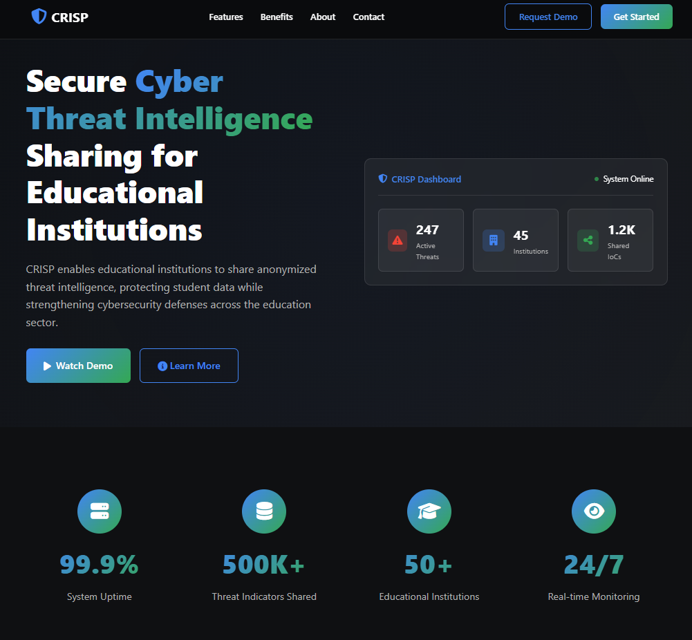
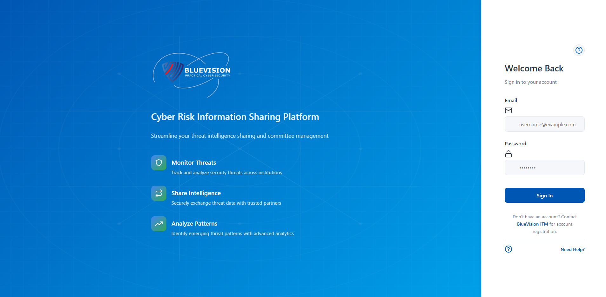
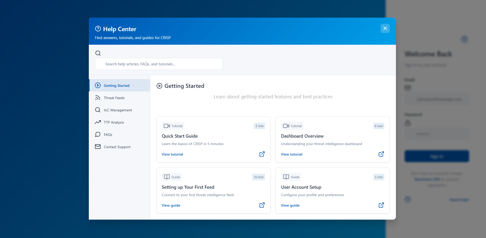

# CRISP User Manual
## Cyber Risk Information Sharing Platform

### Table of Contents
1. [Getting Started](#getting-started)
2. [User Roles](#user-roles)
3. [Authentication](#authentication)
4. [Dashboard Overview](#dashboard-overview)
5. [Publishing Threat Intelligence](#publishing-threat-intelligence)
6. [Consuming Threat Intelligence](#consuming-threat-intelligence)
7. [Managing Alerts](#managing-alerts)
8. [User Management](#user-management)
9. [Trust Relationships](#trust-relationships)
10. [API Access](#api-access)

---

### Getting Started

CRISP is a web-based platform designed to facilitate secure sharing of cyber threat intelligence between educational institutions. The platform supports STIX/TAXII standards and provides anonymization capabilities to protect sensitive institutional data.

**Landing Page**

**System Requirements:**
- Modern web browser (Chrome, Firefox, Safari, Edge - latest 2 versions)
- Internet connection
- Valid user credentials

---

### User Roles

**System Administrator (BlueVision ITM)**
- Full platform access and management
- Institution onboarding and configuration
- Global system monitoring

**Institution Publisher**
- Publish and consume threat intelligence
- Manage institution users
- Configure sharing policies

**Institution Viewer**
- View threat intelligence
- Receive alerts
- Export data for integration

---

### Authentication

1. **Login Process:**
   - Navigate to CRISP platform URL
   - Enter username and password
   - Click "Login"
   - Session timeout: 60 minutes of inactivity

2. **Password Requirements:**
   - Minimum 8 characters
   - Mixed case letters, numbers, special characters
   - Account locks after 5 failed attempts

3. **Password Reset:**
   - Click "Forgot Password" on login page
   - Enter email address
   - Follow instructions in reset email

   ***Login View***

---

### Dashboard Overview

Upon login, users see a personalized dashboard displaying:

- **Recent Threat Intelligence:** Latest published threats relevant to your institution
- **Active Alerts:** High-priority security notifications
- **Statistics:** Threat counts, sharing metrics, system health
- **Quick Actions:** Shortcuts to frequently used features

**Navigation Menu:**
- **Home:** Return to dashboard
- **Threats:** Browse and search threat intelligence
- **Publish:** Create new threat reports (Publishers only)
- **Alerts:** Manage notification preferences
- **Users:** Institution user management (Publishers only)
- **Settings:** Account and institution configuration

---

### Publishing Threat Intelligence

**For Institution Publishers:**

1. **Manual Entry:**
   - Click "Publish" → "New Threat Report"
   - Select threat type (Malware, IP, Domain, Hash, Email, etc.)
   - Enter indicators of compromise (IoCs)
   - Add description and severity level
   - Specify tactics, techniques, and procedures (TTPs)
   - Preview anonymized version
   - Submit for publication

2. **Bulk Upload:**
   - Click "Publish" → "Bulk Upload"
   - Select CSV or JSON file
   - Map data fields to CRISP schema
   - Review validation results
   - Confirm upload

3. **Data Validation:**
   - System automatically validates STIX compliance
   - Checks for required fields and format consistency
   - Displays errors for correction before publication

**Anonymization Preview:**
Before publishing, review how your data will appear to other institutions:
- IP addresses masked (e.g., 192.168.1.XXX)
- Email domains redacted (e.g., user@XXX.com)
- Institution-specific identifiers removed

---

### Consuming Threat Intelligence

1. **Browse Threats:**
   - Navigate to "Threats" section
   - Use filters: threat type, date range, severity
   - View detailed threat information
   - Check anonymization level based on trust relationships

2. **Search Functionality:**
   - Enter keywords in search bar
   - Filter by indicators, descriptions, or TTPs
   - Sort by date, severity, or relevance

3. **Export Data:**
   - Select threats for export
   - Choose format: JSON, CSV, STIX
   - Download for integration with security tools

4. **External Feed Integration:**
   - System automatically consumes external STIX/TAXII feeds
   - Validates and normalizes incoming data
   - Tags threats relevant to education sector

---

### Managing Alerts

1. **Alert Configuration:**
   - Go to "Alerts" → "Subscriptions"
   - Select threat types of interest
   - Set severity thresholds
   - Choose notification methods (email, web interface)

2. **Alert Types:**
   - **High-Priority Threats:** Immediate notifications for critical risks
   - **Sector-Specific:** Threats targeting educational institutions
   - **Custom Criteria:** Based on your specified parameters

3. **Alert Management:**
   - View active alerts on dashboard
   - Mark alerts as read/unread
   - Archive or dismiss notifications
   - Generate reports on alert trends

---

### User Management

**For Institution Publishers:**

1. **Invite New Users:**
   - Go to "Users" → "Invite User"
   - Enter email address
   - Select role (Publisher or Viewer)
   - Send invitation email
   - User completes registration process

2. **Manage Existing Users:**
   - View list of institution users
   - Modify user roles and permissions
   - Deactivate user accounts
   - Reset user passwords

3. **User Permissions:**
   - **Publishers:** Full access to institution data and user management
   - **Viewers:** Read-only access to authorized threat intelligence

---

### Trust Relationships

**Trust Levels:**
- **Public:** Basic anonymized sharing with all institutions
- **Trusted:** Sharing with selected partners
- **Restricted:** Limited sharing with closest allies

**Configuration (System Admin only):**
1. Navigate to "Trust Management"
2. Select institution pairs
3. Set trust level and anonymization policies
4. Configure bilateral or community-based relationships

**Impact on Data Sharing:**
- Higher trust = more detailed information sharing
- Lower trust = increased anonymization
- Configurable per data type and threat category

---

### Support and Troubleshooting

**Common Issues:**
- **Login Problems:** Check credentials, clear browser cache
- **Slow Performance:** Verify internet connection, try different browser
- **Data Upload Errors:** Validate file format and required fields

**Getting Help:**
- Check in-app help documentation
- Contact your Institution Publisher for user issues
- System Administrators can reach BlueVision ITM support

**Security Best Practices:**
- Log out when finished
- Don't share credentials
- Report suspicious activity immediately
- Keep browsers updated

**Help Page**

---

### System Status

Monitor platform health and performance:
- System uptime target: 95%
- Response time: <5 seconds for standard operations
- Data processing: 1000 threat records per second
- Alert delivery: Within 60 seconds of triggering conditions

For technical support or advanced configuration, contact your system administrator or BlueVision ITM support team.